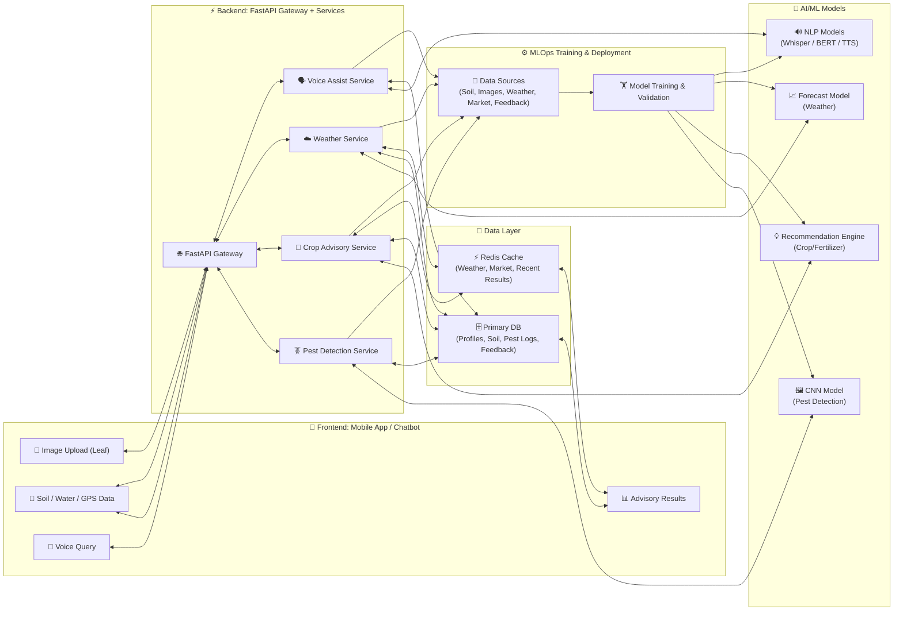

```mermaid
flowchart LR
    %% --- Frontend Layer ---
    subgraph Frontend [📱 Frontend: Mobile App / Chatbot]
        ImageUpload["📸 Image Upload (Leaf)"]
        SoilData["🌱 Soil / Water / GPS Data"]
        VoiceQuery["🎤 Voice Query"]
        Results["📊 Advisory Results"]
    end

    %% --- Backend Layer ---
    subgraph Backend [⚡ Backend: FastAPI Gateway + Services]
        FastAPI["🌐 FastAPI Gateway"]
        PestService["🪳 Pest Detection Service"]
        CropService["🌾 Crop Advisory Service"]
        WeatherService["☁️ Weather Service"]
        VoiceService["🗣️ Voice Assist Service"]
    end

    %% --- AI/ML Layer ---
    subgraph ML [🤖 AI/ML Models]
        CNN["🖼️ CNN Model<br/>(Pest Detection)"]
        RecoEngine["💡 Recommendation Engine<br/>(Crop/Fertilizer)"]
        ForecastModel["📈 Forecast Model<br/>(Weather)"]
        NLP["🔊 NLP Models<br/>(Whisper / BERT / TTS)"]
    end

    %% --- Database Layer ---
    subgraph Database [💾 Data Layer]
        PrimaryDB["🗄️ Primary DB<br/>(Profiles, Soil, Pest Logs, Feedback)"]
        Redis["⚡ Redis Cache<br/>(Weather, Market, Recent Results)"]
    end

    %% --- MLOps Layer ---
    subgraph MLOps [⚙️ MLOps Training & Deployment]
        DataSources["📂 Data Sources<br/>(Soil, Images, Weather, Market, Feedback)"]
        TrainingPipeline["🏋️ Model Training & Validation"]
    end

    %% --- Flows: Frontend <-> Backend ---
    ImageUpload <--> FastAPI <--> PestService <--> CNN
    SoilData <--> FastAPI <--> CropService <--> RecoEngine
    SoilData <--> FastAPI <--> WeatherService <--> ForecastModel
    VoiceQuery <--> FastAPI <--> VoiceService <--> NLP

    %% --- Service <-> Database Connections ---
    PestService <--> PrimaryDB
    CropService <--> PrimaryDB
    WeatherService <--> PrimaryDB
    VoiceService <--> PrimaryDB
    WeatherService <--> Redis
    CropService <--> Redis

    %% --- Results Back to User ---
    PrimaryDB <--> Results
    Redis <--> Results

    %% --- Feedback Loop for Retraining ---
    CropService --> DataSources
    PestService --> DataSources
    WeatherService --> DataSources
    VoiceService --> DataSources
    DataSources --> TrainingPipeline
    TrainingPipeline --> CNN
    TrainingPipeline --> RecoEngine
    TrainingPipeline --> ForecastModel
    TrainingPipeline --> NLP
```
